# Chirpstack device keygen

## Initial setup
### Clone the repository
```
git clone https://github.com/Aleksi1212/chirpstack_device_keygen.git
```

### Create a .env file from the .env.example
```
GATEWAY_ADDRESS="network_address"
LORA_API_TOKEN="api_key"
APP_ID="app_id"
DEVICE_PROFILE_ID="profile_id"
```

## Getting key variables
Go to the network address of the Raspberry Pi running the chirpstack lorawan gateway. (If the gateway isn't connected to a network, you can connect to it's Access point. SSID: ```ChirpStackAP-XXXXXX```, PW: ```ChirpStackAP```. Then go to: ```http://192.168.0.1:8080```, username and password should both be ```admin```).

### GATEWAY_ADDRESS
The network address of the gateway. e.g. ```192.168.0.1:8080``` or ```example.com```

### LORA_API_TOKEN
In the chirpstack console in the sidebar go to: "Tenant" > "API keys".

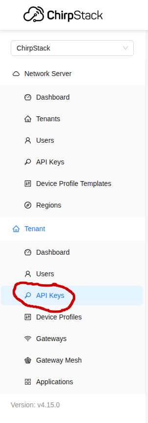

Click "Add API key".

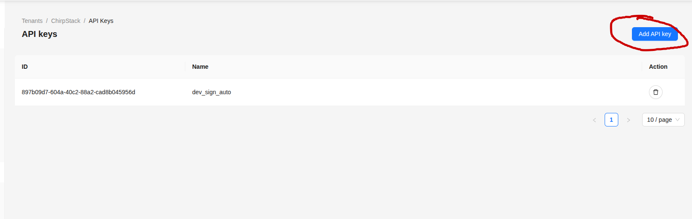

Enter Name, then "submit".

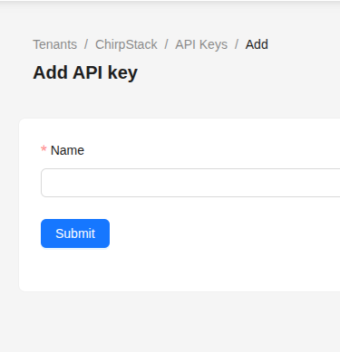

Copy the generated key into the .env file:
```
LORA_API_TOKEN="api_key"
```

### APP_ID
In the sidebar under: "Tenant" > "Applications". If there is an application click it and copy the "application id".

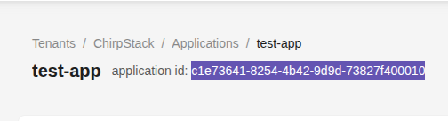

If there isn't an application create a new one "add application" > Enter name > "Submit". Then copy the "application id".

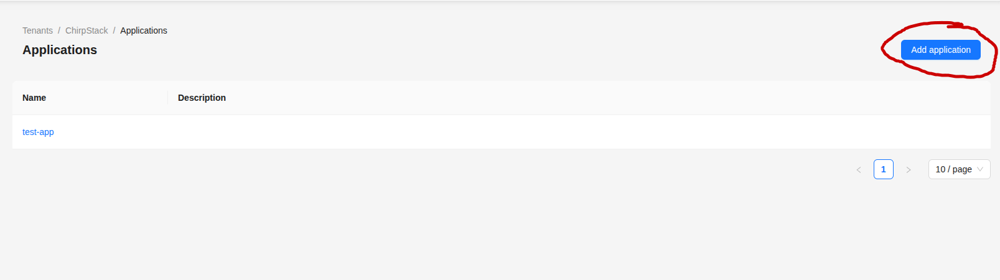

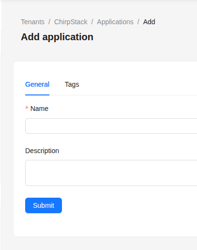

Copy the "application id" into the .env file:
```
APP_ID="app_id
```

### DEVICE_PROFILE_ID
In the sidebar under: "Tenant" > "Device Profiles". If there is a Device profile click it and copy the "device profile id".

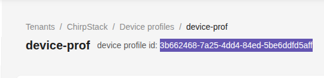

If not then: "Add device profile" > Enter name > "Submit". (The default settings for the device profile are fine).

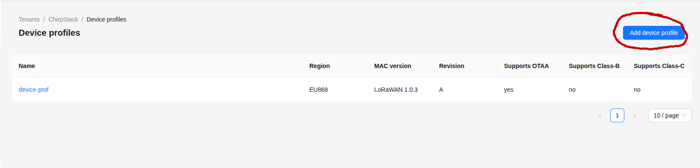

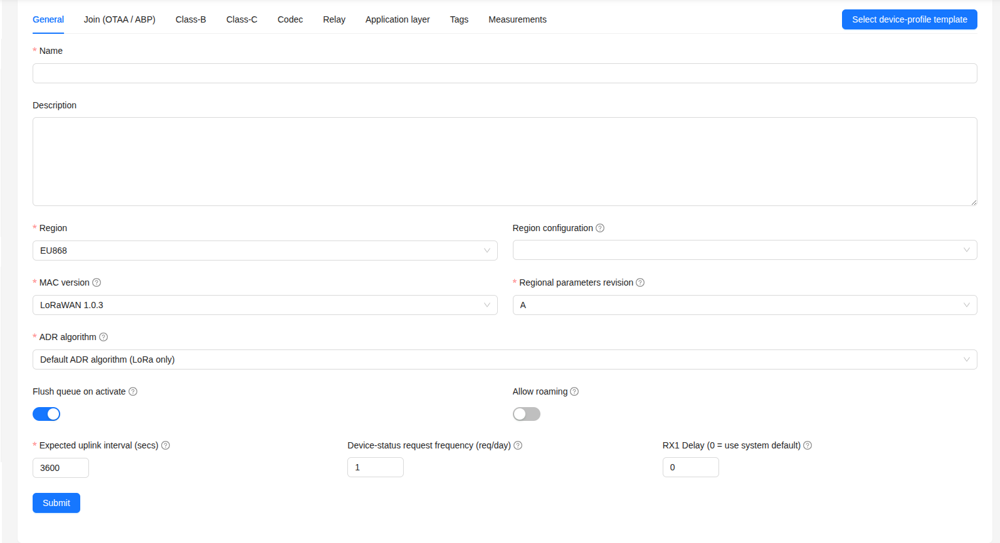

Copy the "device profile id" into the .env file:
```
DEVICE_PROFILE_ID="profile_id"
```

## Building
- Requires docker: https://www.docker.com/get-started/

Run the compose.yml file (creates a docker container and runs it):

***This needs to be run as admin***
```
docker compose up -d
```

If you want to stop the container

***As admin***
```
docker compose down
```

### Possible errors
```Error response from daemon: failed to set up container networking: driver failed programming external connectivity on endpoint chirpstack_keygen (2555a3598f9fbf1b44021c258cdaf856504c4172cfa1685bf774ed1c387c9002): failed to bind host port for 0.0.0.0:3000:<ip>:3000/tcp: address already in use```<br>
Means that the port 3000 the container tries to use is already busy.

***Solutions:***<br>
Change the port in the compose.yml file:
```
version: "3.9"

services:
  app:
    build: .
    container_name: chirpstack_keygen
    ports:
      - <new unused port number>:3000
    env_file:
      - ./.env
    command: ["node", "."]
```

Or free the busy port:

***Linux***
```
sudo fuser -k 3000/tcp
```
***Windows***
```
netstat -ano | findstr :3000
```

## Generating the access keys
- Make sure that the gateway address is reachable

Go to: ```http://localhost:PORT```. (Normally PORT is 3000, but if you changed it in the compose.yml file, then the new port).

Enter you lorawan antenna's DevEui, a name of your choice and click "Generate"

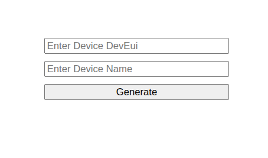

A pop-up appears with the key (REMEMBER TO COPY IT!).

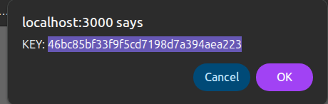

### Common errors
- ```Error generating device: Invalid string length```. Means that the DevEui is invalid

- ```Error generating device: UNIQUE constraint failed: device.dev_eui```. Means that the access key for the DevEui already exists.